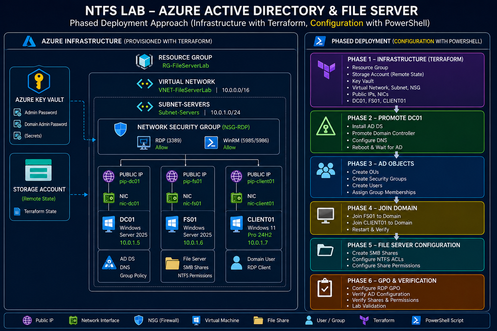
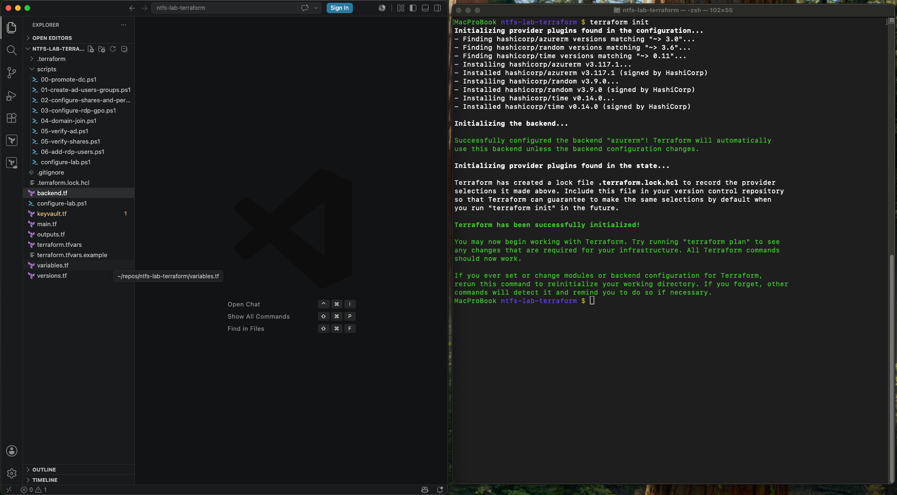
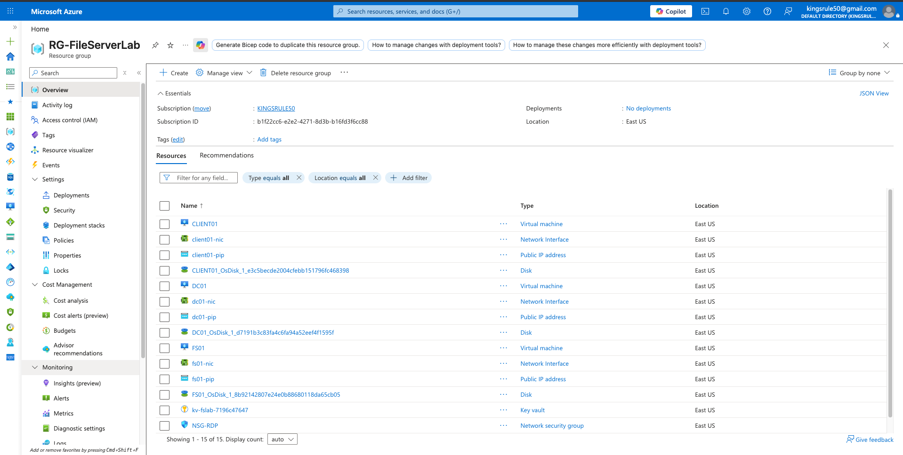
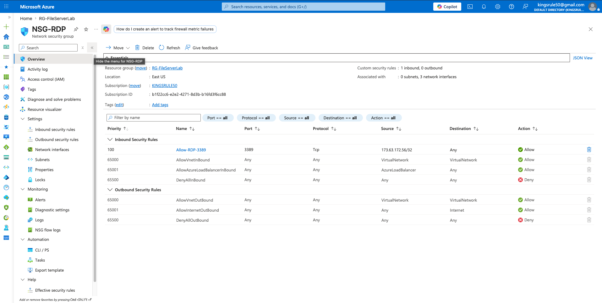
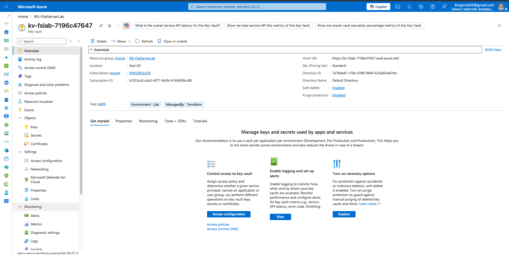
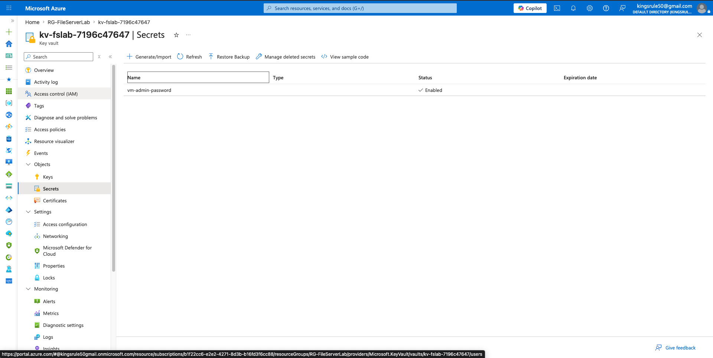
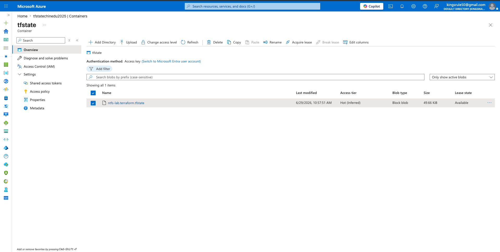
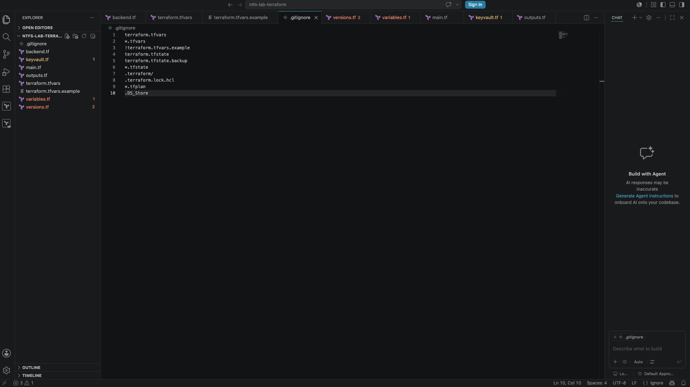

# Lab 1: Azure Infrastructure with Terraform


## Overview

This is the first lab in a three-part series demonstrating enterprise-grade cloud infrastructure and Windows Server administration skills. In this lab, I use **Terraform** to provision the foundational Azure infrastructure for a three-tier Windows lab environment.

This lab follows the recommended best practice of keeping infrastructure provisioning separate from OS-level configuration. Terraform handles **only** the Azure resources. All Active Directory and file server configuration is handled in Labs 2 and 3.

---

## Lab Series

| Lab | Title | Skills |
|-----|-------|--------|
| **Lab 1** (this repo) | Azure Infrastructure with Terraform | Terraform, Azure Networking, IaC |
| [Lab 2](https://github.com/kingsrule50/ntfs-lab-ad) | Active Directory Domain Services | Windows Server, AD DS, GPO, PowerShell |
| [Lab 3](https://github.com/kingsrule50/ntfs-lab-fileserver) | NTFS File Server and Access Control | SMB, NTFS, RBAC, Access Control |

---

## Architecture


*Full series architecture — infrastructure provisioned with Terraform (this lab), configuration applied with phased PowerShell (Labs 2 and 3).*

```
Azure Subscription (KINGSRULE50)
└── Resource Group: RG-FileServerLab (East US)
    ├── Virtual Network: VNET-FileServerLab (10.0.0.0/16)
    │   └── Subnet: Subnet-Servers (10.0.1.0/24)
    ├── Network Security Group: NSG-RDP
    │   └── Inbound Rule: Allow RDP (3389)
    ├── DC01 - Windows Server 2025 Datacenter
    │   ├── Private IP: 10.0.1.5 (Static - DNS Server)
    │   └── Public IP: dc01-pip (Static)
    ├── FS01 - Windows Server 2025 Datacenter
    │   ├── Private IP: 10.0.1.6 (Static)
    │   └── Public IP: fs01-pip (Static)
    ├── CLIENT01 - Windows 11 Pro 24H2
    │   ├── Private IP: 10.0.1.7 (Static)
    │   └── Public IP: client01-pip (Static)
    └── Key Vault: kv-fslab-* (VM credentials)
```

---

## Resources Deployed

| Resource | Name | Purpose |
|----------|------|---------|
| Resource Group | RG-FileServerLab | Container for all lab resources |
| Virtual Network | VNET-FileServerLab | Private network for all VMs |
| Subnet | Subnet-Servers | Single subnet for all three VMs |
| NSG | NSG-RDP | Restricts RDP access to specified IP |
| Public IP | dc01-pip | Static public IP for DC01 |
| Public IP | fs01-pip | Static public IP for FS01 |
| Public IP | client01-pip | Static public IP for CLIENT01 |
| NIC | dc01-nic | Network interface for DC01 |
| NIC | fs01-nic | Network interface for FS01 |
| NIC | client01-nic | Network interface for CLIENT01 |
| VM | DC01 | Windows Server 2025 Domain Controller |
| VM | FS01 | Windows Server 2025 File Server |
| VM | CLIENT01 | Windows 11 Pro Domain Client |
| Key Vault | kv-fslab-* | Stores VM admin credentials securely |

---

## Key Design Decisions

- **Static private IPs** — DC01 (`10.0.1.5`), FS01 (`10.0.1.6`), CLIENT01 (`10.0.1.7`) are hardcoded to prevent IP conflicts across deployments
- **VNet DNS set to DC01** — All VMs automatically use DC01 as their DNS server, enabling domain resolution without manual configuration
- **Static public IPs** — RDP addresses never change between deployments
- **Remote state** — Terraform state stored in Azure Blob Storage for team collaboration and state locking
- **Key Vault** — VM admin password stored securely, never in a file
- **No OS-level config in Terraform** — Follows the phased deployment best practice; all post-provisioning work is in Labs 2 and 3

---

## Prerequisites

- Azure CLI installed and authenticated (`az login`)
- Terraform >= 1.5.0 installed
- An Azure subscription with sufficient vCPU quota for `Standard_D2s_v3`
- Remote state storage account already created (see `backend.tf`)

---

## Usage

**Step 1 — Set your admin password as an environment variable:**
```bash
export TF_VAR_admin_password="YourStrongPassword123!"
```

**Step 2 — Initialize Terraform:**
```bash
terraform init
```


*Terraform initializes the `azurerm` remote state backend and installs pinned providers.*

**Step 3 — Review the plan:**
```bash
terraform plan
```

**Step 4 — Deploy:**
```bash
terraform apply -auto-approve
```

**Step 5 — Note the outputs:**
```
dc01_public_ip     = "x.x.x.x"
fs01_public_ip     = "x.x.x.x"
client01_public_ip = "x.x.x.x"
key_vault_name     = "kv-fslab-xxxx"
```

**Step 6 — Proceed to Lab 2:**
Once all three VMs are running, proceed to [Lab 2 - Active Directory](https://github.com/kingsrule50/ntfs-lab-ad).

---

## Deployment Results

**All 15 resources deployed to RG-FileServerLab:**


*Three VMs (DC01, FS01, CLIENT01) with NICs, public IPs, managed disks, NSG, and Key Vault — all provisioned by a single `terraform apply`.*

**Network Security Group — RDP locked to a single source IP:**


*Inbound RDP (3389) is allowed only from my `/32` source address. Everything else inbound is denied.*

**Key Vault provisioned and tagged by Terraform:**


*Note the `ManagedBy: Terraform` tag — the vault is created as part of the deployment, not manually.*


*The VM admin password lives in Key Vault as `vm-admin-password`. It is never written to a file or committed to the repo.*

**Remote state stored in Azure Blob Storage:**


*`ntfs-lab.terraform.tfstate` in the `tfstate` container — enabling state locking and safe re-runs from any machine.*

---

## Teardown

```bash
terraform destroy -auto-approve
```

---

## File Structure

```
ntfs-lab-terraform/
├── main.tf                  # All Azure resources
├── variables.tf             # Input variables
├── outputs.tf               # Output values (IPs, Key Vault name)
├── backend.tf               # Remote state configuration
├── keyvault.tf              # Key Vault and secret management
├── versions.tf              # Provider version constraints
├── terraform.tfvars         # Variable values (not committed)
└── terraform.tfvars.example # Template for required variables
```


*The project in VS Code — `.gitignore` excludes `terraform.tfvars`, state files, and plan files so no secrets ever reach the repo.*

---

## Skills Demonstrated

- Infrastructure as Code with Terraform
- Azure Virtual Network design and subnetting
- Network Security Group configuration
- Static IP address management
- Azure Key Vault integration for secret management
- Terraform remote state with Azure Blob Storage
- Phased deployment architecture (separation of concerns)

---

## Author

**Chinedu Asuzu** | Cloud Security Engineer  
[GitHub](https://github.com/kingsrule50) | [LinkedIn](https://linkedin.com/in/chineduasuzu)  
Certifications: CISA | CompTIA Security+ | Microsoft SC-401
